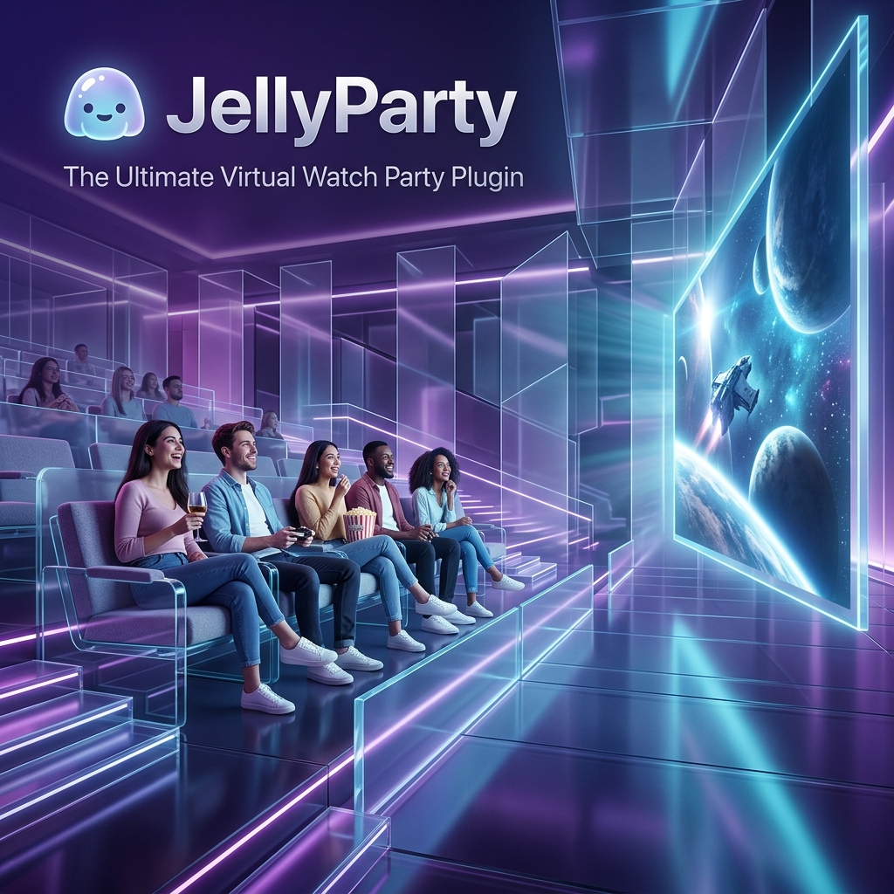

# JellTogether

Interactive Jellyfin watch party plugin for synced viewing.

A high-performance watch party plugin focusing on synchrony and social interaction.

## Access
- Jellyfin menu: open **JellTogether** from the regular main menu or from the server dashboard plugin area.
- Direct companion URL: `/jelltogether/Companion`
- Jellyfin invite URL format: `/jelltogether/Invite/YOURCODE`
- Optional public companion URL format: `https://your-domain.example/Invite/YOURCODE`

Server owners can set their own public Jellyfin URL and public companion URL inside the JellTogether companion.

## Features
- Persistent room management
- Thread-safe session handling
- Social chat and floating reactions
- Immersive VR Mode (WebXR)
- Live Polls and Theory Boards
- Collaborative media queueing
- Discord Stage integration
